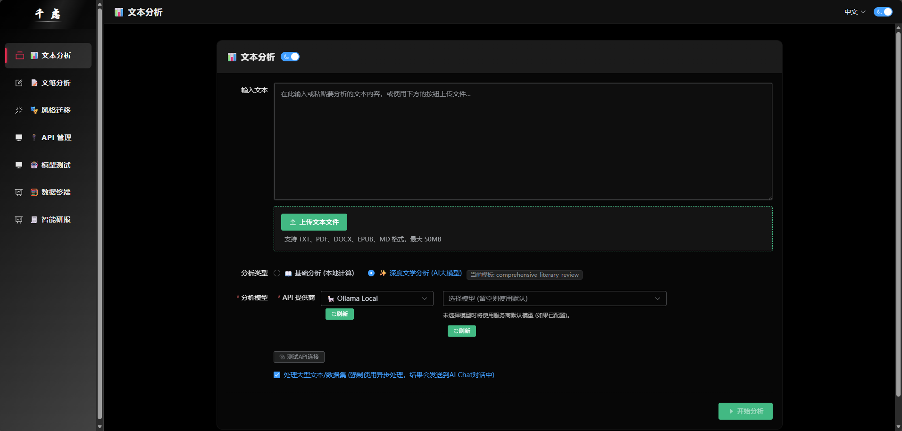
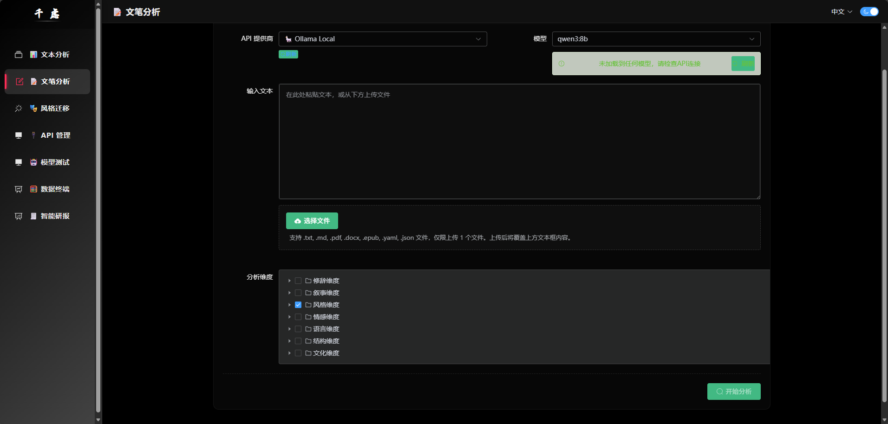
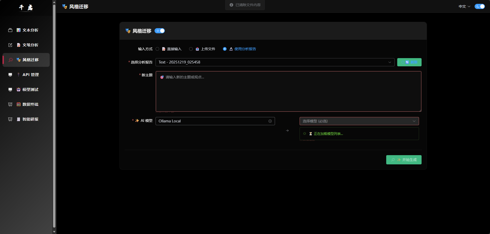
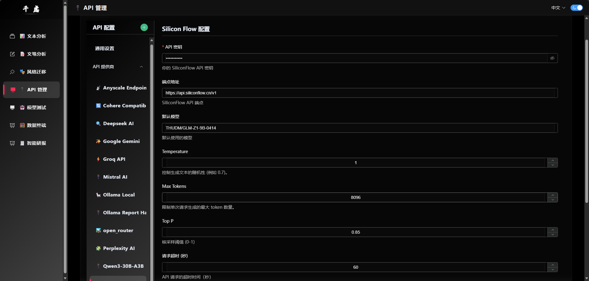
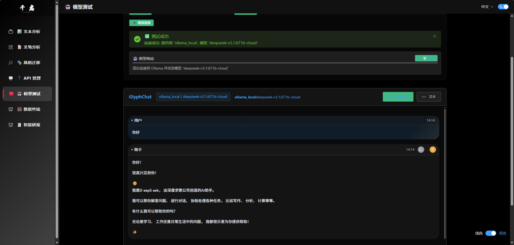
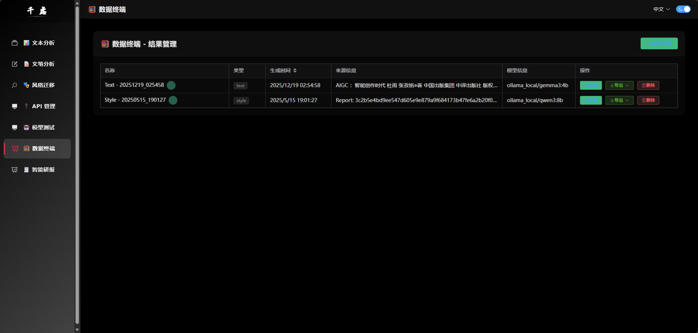
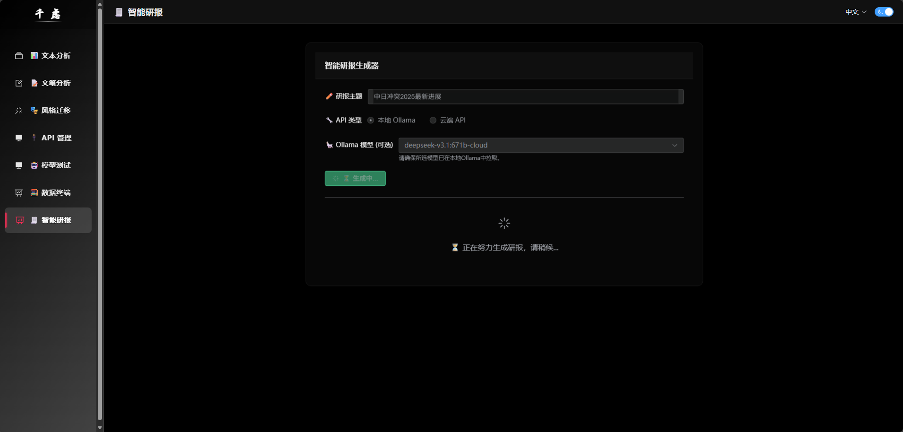
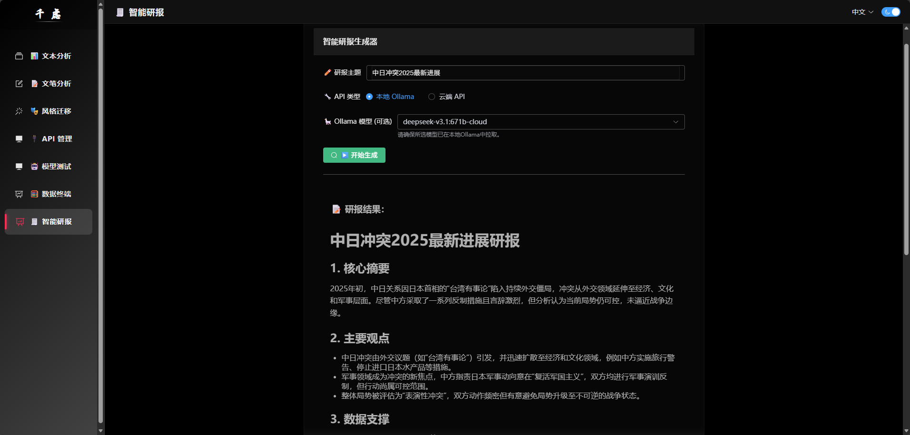

# 千虑 (QianLv)

<div align="center">


**智能文本分析与研报生成系统**

基于大语言模型的多功能文本处理平台，支持文本分析、文学评论、风格迁移、智能研报生成等功能

[快速开始](#快速开始) • [功能特性](#功能特性) • [在线演示](#在线演示) • [文档](#文档) • [贡献指南](#贡献指南)

</div>

---

## 📖 目录

- [项目简介](#项目简介)
- [核心特性](#核心特性)
- [技术栈](#技术栈)
- [快速开始](#快速开始)
- [功能展示](#功能展示)
- [系统架构](#系统架构)
- [详细文档](#详细文档)
- [配置说明](#配置说明)
- [开发指南](#开发指南)
- [常见问题](#常见问题)
- [贡献指南](#贡献指南)
- [许可证](#许可证)

---

## 项目简介

千虑 (QianLv) 是一个**专业级AI文本处理平台**，不只是简单的文本分析工具，而是**从分析到创作的全流程智能解决方案**。通过深度文学分析提取风格特征，实现高质量的风格模仿和文案改写，让AI真正赋能内容创作。

### 🎯 核心定位

**为内容创作者、研究人员、媒体从业者提供：**
- 📖 **学习优秀作品** - 深度分析名家作品的写作手法，提取可复用的风格特征
- ✍️ **提升创作质量** - 基于风格分析，生成高质量的改写和创作
- 📊 **自动化研报** - AI自主规划、搜索、分析、撰写，3-5分钟生成专业研报
- 🔄 **灵活AI选择** - 14+服务商无缝切换，本地+云端双模式，降低成本

### 💡 为什么选择千虑？

#### 1. **文学分析 + 风格迁移 = 最强组合** ⭐
不同于其他工具只能简单改写，千虑通过**5维度深度分析**提取**50+风格特征**，实现真正高质量的风格模仿：
```
优秀文案 → 深度分析 → 提取风格 → 应用到你的文本 → 高质量改写
```

#### 2. **AI自主完成研报全流程** 🤖
让AI自己规划、搜索、分析、撰写，真正的自动化：
```
输入主题 → AI规划策略 → 自动搜索 → AI分析整合 → 生成专业研报
```

#### 3. **14+AI服务商灵活切换** 🌐
避免单一依赖，降低成本，提高可用性：
- 🏠 **本地Ollama** - 数据安全、无API成本
- ☁️ **云端API** - 性能强大、效果更好
- 💰 **成本优化** - 选择性价比最高的方案

#### 4. **专业风格模板库** 📚
提供多种专业模板，适应不同场景：
- **深度创作风格** - 8维度，50+特征，适合文学作品
- **快速风格提取** - 5核心维度，适合短文本
- **新闻风格提取** - 6新闻维度，符合行业标准

### 🎯 适用场景

| 用户群体 | 核心需求 | 千虑的价值 |
|---------|---------|-----------|
| **内容创作者** | 文案改写、风格学习 | 学习优秀作品手法，快速生成不同风格文案 |
| **媒体从业者** | 新闻改写、热点分析 | 提取新闻风格，快速生成热点分析报告 |
| **文学研究者** | 作品分析、风格研究 | 多维度深度分析，提取风格特征研究 |
| **学生/教师** | 论文写作、教学辅助 | 分析学术风格，辅助论文写作和教学 |
| **企业用户** | 市场研报、竞品分析 | 自动生成行业研报，分析竞品文案 |

---

## 核心特性

### 🔍 文本分析模块
- **情感分析**：识别文本情感倾向，支持正面/负面/中性分类及强度评分
- **关键词提取**：自动提取核心关键词，支持TF-IDF、TextRank等算法
- **可读性分析**：计算Flesch可读性指数、词汇多样性等指标
- **词频统计**：生成词云图和词频分布可视化
- **语言特征**：识别语法结构、修辞手法、语言风格

### 📚 文学创作分析
- **V2多维度模板**：基于专业文学分析框架
- **5大分析维度**：
  - 人物塑造（性格特点、发展弧线、关系网络）
  - 情节构建（叙事结构、冲突设置、节奏控制）
  - 主题探讨（核心思想、象征意义、社会意义）
  - 语言风格（修辞手法、词汇选择、句式特点）
  - 写作技巧（叙事视角、时空处理、描写手法）
- **可选维度分析**：用户自由选择感兴趣的分析维度
- **专业分析报告**：生成结构化的深度文学评论

### 🎨 风格迁移
- **预设风格库**：正式/非正式、学术/通俗、文言/白话等
- **自定义风格**：支持用户定义目标风格特征
- **智能转换**：保持原意的同时调整语言风格
- **风格验证**：自动验证转换效果

### 📈 智能研报生成
- **LLM驱动**：自动规划搜索策略、整合信息、生成研报
- **三种生成模式**：
  - 本地Ollama模式
  - 云端API模式（支持14+服务商）
  - 热点话题模式（基于实时热点）
- **结构化输出**：包含摘要、分析、数据、预测、建议等章节
- **Markdown格式**：支持富文本导出

### 🤖 多AI服务商支持

支持**14+**主流AI服务商，灵活切换：

| 服务商 | 类型 | 特点 |
|--------|------|------|
| Ollama Local | 本地 | 私有部署，数据安全 |
| Deepseek AI | 云端 | 性价比高，中文优秀 |
| Google Gemini | 云端 | 多模态能力强 |
| OpenRouter | 云端 | 多模型聚合 |
| Silicon Flow | 云端 | 国内访问快 |
| Zhipu AI | 云端 | 智谱清言 |
| Groq | 云端 | 推理速度快 |
| ... | ... | 更多服务商 |

### 💬 交互式聊天测试
- 多模型对话测试
- 流式输出（SSE）
- 对话历史管理
- Markdown渲染
- 代码高亮

### 🗄️ 数据终端
- 结果统一管理
- 多格式导出（Markdown/Word/Text）
- 结果重命名和删除
- 元数据查看

---

## 技术栈

### 后端
- **框架**：FastAPI 0.110+ | Uvicorn | Python 3.12
- **数据库**：SQLAlchemy 2.0+ | SQLite/PostgreSQL
- **AI/NLP**：Transformers | Sentence-Transformers | NLTK | Jieba | TextBlob
- **文件处理**：PyMuPDF | python-docx | EbookLib | pdfplumber
- **API集成**：httpx | aiohttp | requests
- **工具**：Loguru | PyYAML | jsonschema | aiofiles

### 前端
- **框架**：Vue 3.4+ | Vue Router 4 | Vue I18n 9
- **UI组件**：Element Plus 2.5+ | ECharts 5 | Vue-ECharts 6
- **数据处理**：Axios | Lodash | Jieba-JS
- **文档处理**：Marked | Highlight.js | jsPDF | docx
- **动画**：GSAP | Chart.js

### 开发工具
- **构建**：Vite / Vue CLI 5
- **代码规范**：ESLint | Prettier
- **测试**：Pytest | Jest
- **版本控制**：Git

---

## 快速开始

### 环境要求

- Python 3.12+
- Node.js 16+
- 至少4GB可用内存

### 安装步骤

#### 1. 克隆项目

```bash
git clone <repository-url>
cd QianLv
```

#### 2. 安装后端依赖

```bash
# 使用项目自带的Conda环境（推荐）
.\conda_env\python.exe -m pip install -r requirements.txt

# 创建新的虚拟环境
python -m venv venv
venv\Scripts\activate  # Windows
source venv/bin/activate  # Linux/Mac
pip install -r requirements.txt
```

#### 3. 安装前端依赖

```bash
cd frontend
npm install
```

#### 4. 配置环境变量

编辑 `.env` 文件，配置至少一个AI服务商：

```bash
# 示例：配置Ollama本地服务
OLLAMA_ENDPOINT=http://localhost:11434
OLLAMA_DEFAULT_MODEL=gemma3:12b

# 或配置云端服务
DEEPSEEK_API_KEY=your_api_key_here
DEEPSEEK_DEFAULT_MODEL=deepseek-chat

# 配置搜索API（用于研报生成）
SERPER_API_KEY=your_serper_api_key
```

#### 5. 启动服务

**开发模式：**

```bash
# 启动后端（终端1）
python main.py
# 访问 http://localhost:8000

# 启动前端（终端2）
cd frontend
npm run serve
# 访问 http://localhost:8080
```

**生产模式：**

```bash
# 构建前端
cd frontend
npm run build

# 启动后端（自动服务前端）
cd ..
python backend_main.py
# 访问 http://localhost:8000
```

### 使用Ollama本地模型（可选）

```bash
# 安装Ollama
# 下载：https://ollama.ai

# 启动Ollama服务
ollama serve

# 拉取模型
ollama pull gemma3:12b
ollama pull qwen:14b

# 查看已安装模型
ollama list
```

---

## 功能展示

<div align="center">

|  |  |
|:---:|:---:|
| **多维度文本分析** | **专业文学创作分析** |

|  |  |
|:---:|:---:|
| **智能研报自动化生成** | **交互式 AI 对话测试** |

|  |  |
|:---:|:---:|
| **多服务商 API 热配置** | **数据终端统一管理** |

|  |  |
|:---:|:---:|
| **响应式移动端适配** | **现代化 UI 交互设计** |

</div>

---

## 系统架构

### 整体架构

```
┌─────────────────────────────────────────────┐
│           用户浏览器 (Browser)               │
└─────────────────┬───────────────────────────┘
                  │ HTTP/HTTPS
┌─────────────────▼───────────────────────────┐
│         前端层 (Vue 3 + Element Plus)        │
│  ┌──────────┬──────────┬──────────┬───────┐ │
│  │文本分析  │文学分析  │研报生成  │API管理│ │
│  └──────────┴──────────┴──────────┴───────┘ │
└─────────────────┬───────────────────────────┘
                  │ Axios HTTP
┌─────────────────▼───────────────────────────┐
│        后端层 (FastAPI + Python 3.12)       │
│  ┌──────────────────────────────────────┐  │
│  │      API路由层 (Routes)              │  │
│  └──────────┬───────────────────────────┘  │
│  ┌──────────▼───────────────────────────┐  │
│  │   业务逻辑层 (Services + Core)       │  │
│  └──────────┬───────────────────────────┘  │
│  ┌──────────▼───────────────────────────┐  │
│  │   AI服务层 (14+ Providers)           │  │
│  │   Ollama | Deepseek | Gemini | ...   │  │
│  └──────────────────────────────────────┘  │
└─────────────────┬───────────────────────────┘
                  │
┌─────────────────▼───────────────────────────┐
│      数据层 (SQLite + FileSystem + Cache)   │
└─────────────────────────────────────────────┘
```

**详细架构图请查看**：[系统架构与流程图.md](系统架构与流程图.md)

---

## 详细文档

我们提供了完整的项目文档，帮助您深入了解系统：

### 📚 核心文档

| 文档 | 描述 | 链接 |
|------|------|------|
| 项目说明文档 | 完整的项目介绍、安装部署、使用指南 | [项目说明文档.md](项目说明文档.md) |
| 系统架构与流程图 | 10+架构图、8+流程图、部署方案 | [系统架构与流程图.md](系统架构与流程图.md) |
| 项目结构说明 | 目录结构、模块职责、开发规范 | [doc/PROJECT_STRUCTURE.md](doc/PROJECT_STRUCTURE.md) |
| API改进说明 | API配置管理、实时更新机制 | [doc/README_API_IMPROVEMENTS.md](doc/README_API_IMPROVEMENTS.md) |

### 📖 功能文档

| 文档 | 描述 | 链接 |
|------|------|------|
| 智能研报系统设计 | 研报生成系统的完整设计方案 | [doc/INTELLIGENT_REPORT_SYSTEM.md](doc/INTELLIGENT_REPORT_SYSTEM.md) |
| 数据研报功能实现 | 研报功能的实现细节和思路 | [doc/数据研报功能的实现.md](doc/数据研报功能的实现.md) |
| API流式传输指南 | SSE流式响应的实现指南 | [doc/api_streaming_guide.md](doc/api_streaming_guide.md) |
| MCP相关文档 | MCP集成说明 | [doc/MCP.md](doc/MCP.md) |

### 🔧 开发文档

| 文档 | 描述 | 链接 |
|------|------|------|
| 开发日志 | 开发过程中的问题和解决方案 | [doc/development_log.md](doc/development_log.md) |
| 未来功能规划 | 待开发功能和改进建议 | [Future/feature_suggestions.md](Future/feature_suggestions.md) |

### 📊 快速导航

- **新手入门**：从 [项目说明文档.md](项目说明文档.md) 的"快速开始"章节开始
- **了解架构**：查看 [系统架构与流程图.md](系统架构与流程图.md) 中的架构图
- **开发新功能**：参考 [doc/PROJECT_STRUCTURE.md](doc/PROJECT_STRUCTURE.md) 中的开发规范
- **部署上线**：查看 [项目说明文档.md](项目说明文档.md) 的"安装部署"章节
- **故障排查**：参考 [项目说明文档.md](项目说明文档.md) 的"故障排除"章节

---

## 配置说明

### 核心配置文件

| 文件 | 用途 | 说明 |
|------|------|------|
| `.env` | 环境变量配置 | **最重要**：API密钥、服务端点、模型配置 |
| `config/providers_meta.json` | 服务商元数据 | 定义所有支持的AI服务商 |
| `config/app_config.yaml` | 应用配置 | 日志级别等系统配置 |
| `config/promptPRO/` | 提示词模板 | 文学分析等专业模板 |

### 配置AI服务商

在 `.env` 文件中配置服务商信息：

```bash
# === Deepseek AI 示例 ===
DEEPSEEK_API_KEY='your_api_key'
DEEPSEEK_ENDPOINT='https://api.deepseek.com'
DEEPSEEK_DEFAULT_MODEL='deepseek-chat'
DEEPSEEK_TEMPERATURE='0.95'
DEEPSEEK_MAX_TOKENS='8096'

# === Google Gemini 示例 ===
GOOGLE_API_KEY='your_google_api_key'
GOOGLE_DEFAULT_MODEL='gemini-1.5-flash-latest'
GOOGLE_TEMPERATURE='0.7'
GOOGLE_MAX_TOKENS='2048'
```

### 实时配置更新

✨ **无需重启服务**：在前端 `/settings-manager` 页面修改配置后，系统会自动更新 `.env` 文件，下次API调用时立即生效。

**详细配置说明**：[项目说明文档.md - 配置说明](项目说明文档.md#配置说明)

---

## 开发指南

### 项目结构

```
QianLv/
├── backend_main.py          # 后端入口
├── main.py                  # 简化入口
├── frontend/                # 前端代码
│   ├── src/
│   │   ├── views/          # 页面视图
│   │   ├── components/     # 可复用组件
│   │   ├── services/       # API服务
│   │   └── router/         # 路由配置
│   └── dist/               # 构建输出
├── src/                     # 后端代码
│   ├── api/                # API路由和模型
│   ├── core/               # 核心业务逻辑
│   ├── providers/          # AI服务商处理器
│   ├── services/           # 业务服务
│   └── utils/              # 工具函数
├── config/                  # 配置文件
├── data/                    # 数据目录
│   ├── QianLv_data.db   # 数据库
│   └── uploads/            # 上传文件
├── doc/                     # 文档
```

### 开发规范

1. **模块分离**：每个文件专注于一个特定功能
2. **代码复用**：创建新功能前先搜索是否已有相关代码
3. **配置管理**：`.env` 是配置的唯一真实来源
4. **类型提示**：Python使用类型提示，前端使用TypeScript（可选）
5. **错误处理**：统一使用错误处理机制
6. **日志记录**：使用项目提供的logger

### 添加新的AI服务商

1. 在 `config/providers_meta.json` 中添加服务商元数据
2. 在 `.env` 中添加API密钥和配置
3. 在 `src/providers/handlers/` 创建处理器类
4. 继承 `BaseAPIHandler` 并实现 `generate_text()` 方法
5. 重启服务即可使用

**详细开发指南**：[项目说明文档.md - 开发规范](项目说明文档.md#开发规范)

---

## 常见问题

### Q: 如何切换不同的AI模型？

A: 在各功能模块的界面中，都提供了服务商和模型选择下拉框，可以实时切换。

### Q: 支持哪些文件格式？

A: TXT、PDF、DOCX、EPUB、MD 格式，最大50MB。

### Q: 如何使用本地模型？

A: 安装Ollama，拉取模型，在 `.env` 中配置 `OLLAMA_ENDPOINT` 和模型名称即可。

### Q: 配置修改后是否需要重启？

A: 不需要。在前端修改配置后，下次API调用时会自动读取最新配置。

### Q: 如何导出分析结果？

A: 在数据终端页面，点击"导出"按钮，选择格式（Markdown/Word/Text）即可下载。

### Q: 研报生成失败怎么办？

A: 检查：1) API密钥是否正确 2) 网络连接是否正常 3) Serper API是否配置（如需真实搜索）

**更多问题**：[项目说明文档.md - 故障排除](项目说明文档.md#故障排除)

---

## API文档

启动后端服务后，访问以下地址查看完整API文档：

- **Swagger UI**：http://localhost:8000/docs
- **ReDoc**：http://localhost:8000/redoc

### 主要端点

| 端点 | 方法 | 描述 |
|------|------|------|
| `/api/analyze` | POST | 文本分析 |
| `/api/literature-analysis/analyze` | POST | 文学分析 |
| `/api/v1/reports/generate-report` | POST | 生成研报 |
| `/api/chat` | POST | 聊天对话 |
| `/api/providers` | GET | 获取服务商列表 |
| `/api/results` | GET | 获取结果列表 |

**完整API文档**：[项目说明文档.md - API文档](项目说明文档.md#api文档)

---

## 贡献指南

我们欢迎所有形式的贡献！

### 如何贡献

1. Fork 本项目
2. 创建特性分支 (`git checkout -b feature/AmazingFeature`)
3. 提交更改 (`git commit -m 'feat: Add some AmazingFeature'`)
4. 推送到分支 (`git push origin feature/AmazingFeature`)
5. 开启 Pull Request

### 提交信息规范

使用语义化提交信息：

- `feat: 新功能`
- `fix: 修复bug`
- `docs: 文档更新`
- `style: 代码格式`
- `refactor: 重构`
- `test: 测试`
- `chore: 构建/工具`

### 开发建议

- 遵循项目的代码规范
- 添加必要的测试
- 更新相关文档
- 确保所有测试通过

---

## 路线图

### 已完成 ✅

- [x] 多维度文本分析
- [x] 文学创作分析（V2模板）
- [x] 风格迁移
- [x] 智能研报生成
- [x] 14+AI服务商支持
- [x] 实时配置更新
- [x] 交互式聊天测试
- [x] 数据终端管理

### 进行中 🚧

- [ ] 批量文本处理
- [ ] 自定义分析模板编辑器
- [ ] 数据可视化增强

### 计划中 📋

- [ ] 用户认证系统
- [ ] 团队协作功能
- [ ] API限流和配额管理
- [ ] 移动端适配
- [ ] 插件系统
- [ ] 多语言界面支持

**查看完整规划**：[Future/feature_suggestions.md](Future/feature_suggestions.md)

---

## 致谢

感谢以下开源项目：

- [Vue.js](https://vuejs.org/) - 渐进式JavaScript框架
- [FastAPI](https://fastapi.tiangolo.com/) - 现代Python Web框架
- [Element Plus](https://element-plus.org/) - Vue 3组件库
- [ECharts](https://echarts.apache.org/) - 数据可视化库
- [Ollama](https://ollama.ai/) - 本地LLM运行时
- [Transformers](https://huggingface.co/docs/transformers/) - AI模型库

以及所有依赖的开源库和贡献者。

---

## 许可证

本项目采用 [MIT License](LICENSE) 许可证。

---

## 联系方式

- **项目维护者**：lsg1103275794
- **邮箱**：lsg1103275794@qq.com
- **问题反馈**：[GitHub Issues](https://github.com/lsg1103275794/QianLv/issues)
- **讨论交流**：[GitHub Discussions](https://github.com/lsg1103275794/QianLv/discussions)

---

## Star History

如果这个项目对您有帮助，欢迎 ⭐ Star 支持我们！

---

<div align="center">

**[⬆ 回到顶部](#千虑-QianLv)**

Made with ❤️ by QianLv Team

</div>
