# 千虑 (QianLv) - 系统架构与流程图

本文档包含项目的系统架构图和主要业务流程图，帮助开发者快速理解系统设计。

---

## 目录

- [整体系统架构](#整体系统架构)
- [技术栈架构](#技术栈架构)
- [数据流架构](#数据流架构)
- [业务流程图](#业务流程图)
- [组件关系图](#组件关系图)
- [部署架构](#部署架构)

---

## 整体系统架构

### 三层架构图

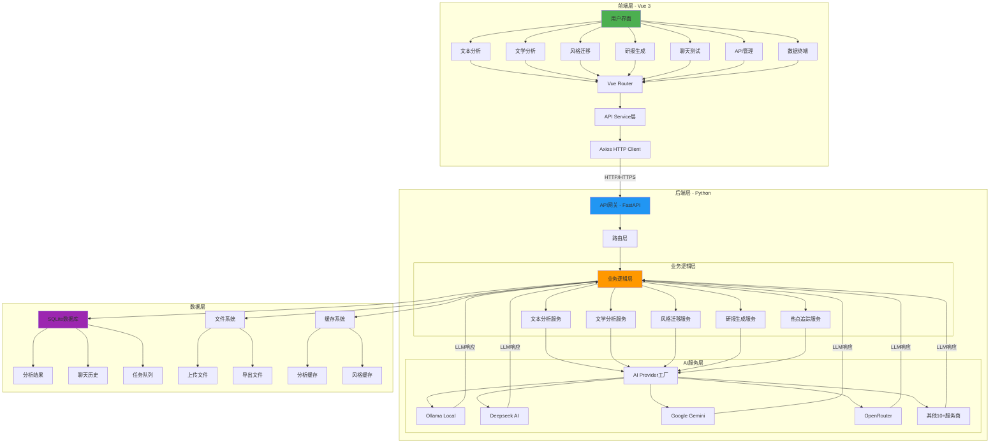

---

## 技术栈架构

### 前端技术栈

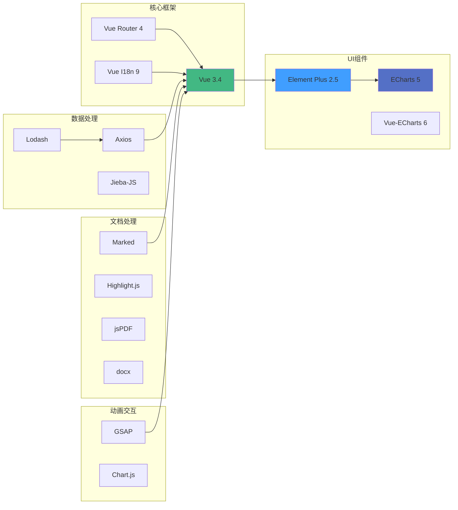

### 后端技术栈

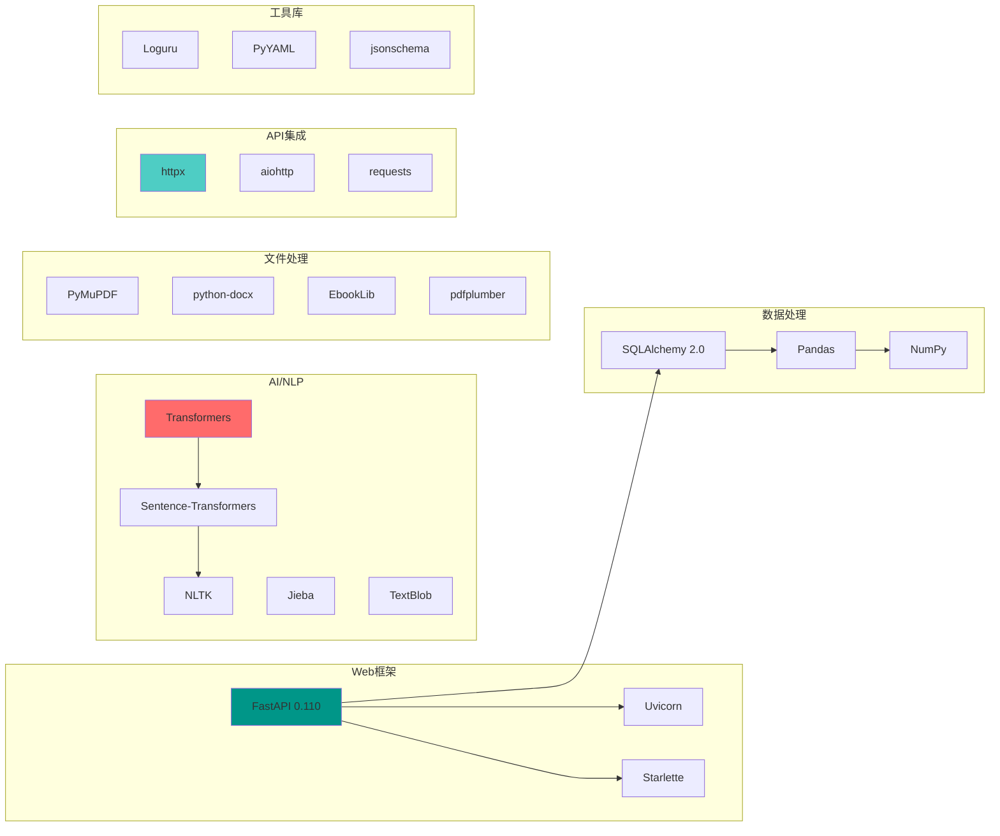

---

## 数据流架构

### 请求处理流程

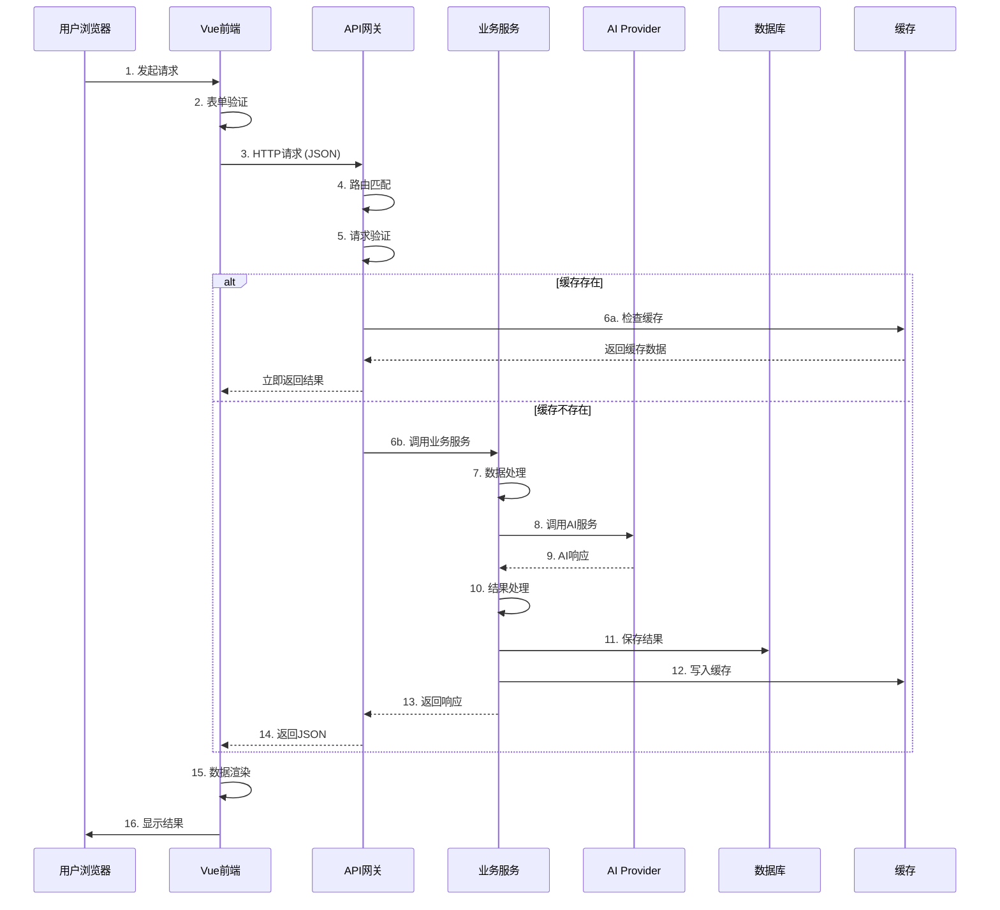

### 配置更新流程

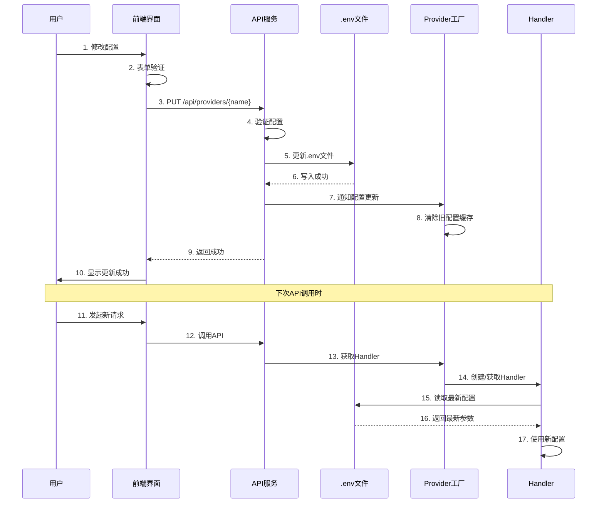

---


## 业务流程图

### 1. 文本分析完整流程

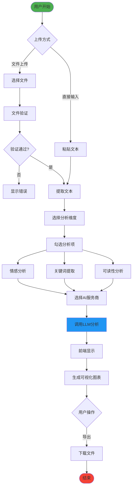

### 2. 智能研报生成流程

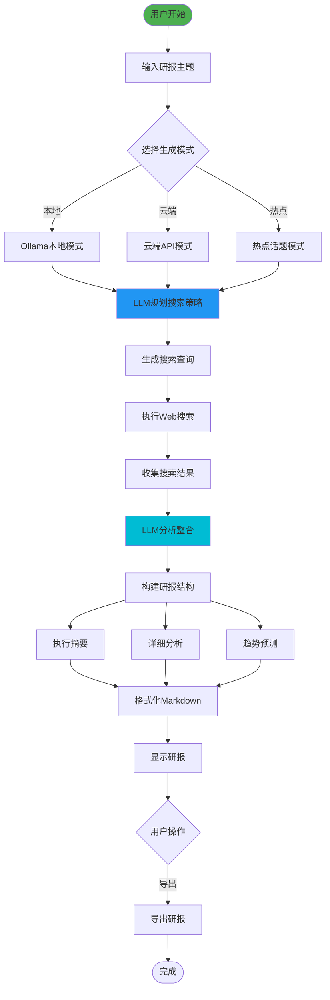

### 3. 文学多维分析与风格迁移流程

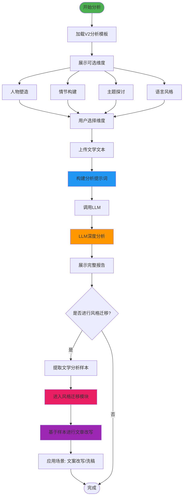

### 4. AI服务商配置流程

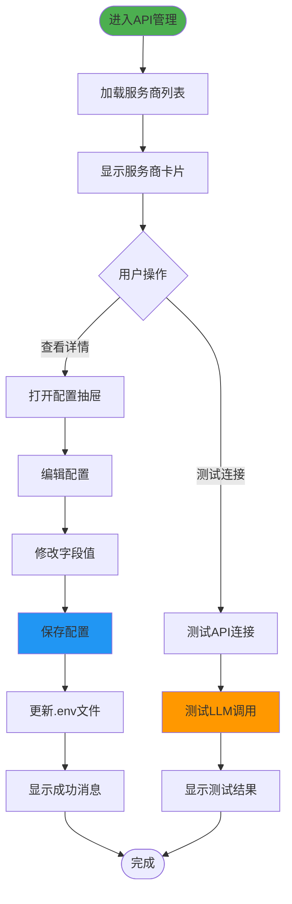

---

## 组件关系图

### 前端组件依赖关系

```mermaid
graph TB
    subgraph "根组件"
        App[App.vue]
    end
    
    subgraph "路由管理"
        Router[Vue Router]
    end
    
    subgraph "页面视图 Views"
        V1[TextAnalysis]
        V2[WritingStyleAnalysis]
        V3[StyleTransfer]
        V4[ReportGeneratorView]
        V5[ModelTestView]
        V6[DataTerminal]
        V7[ApiManager]
    end
    
    subgraph "分析组件 Components/Analysis"
        C1[AnalysisResults]
        C2[SentimentChart]
        C3[KeywordChart]
        C4[ReadabilityChart]
    end
    
    subgraph "API组件 Components/API"
        A1[ApiProviderCard]
        A2[ApiConfigDrawer]
        A3[ApiStatusCheck]
    end
    
    subgraph "聊天组件 Components/Chat"
        CH1[ChatTest]
        CH2[ChatMessages]
        CH3[ChatInput]
    end
    
    subgraph "研报组件 Components/Report"
        R1[ReportForm]
        R2[ReportDisplay]
        R3[ReportLoading]
    end
    
    subgraph "服务层 Services"
        S1[analysisService]
        S2[chatService]
        S3[reportService]
        S4[providerService]
        S5[apiClient]
    end
    
    App --> Router
    Router --> V1 & V2 & V3 & V4 & V5 & V6 & V7
    
    V1 --> C1 & C2 & C3 & C4
    V1 --> S1
    
    V2 --> C1
    V2 --> S1
    
    V4 --> R1 & R2 & R3
    V4 --> S3
    
    V5 --> CH1
    CH1 --> CH2 & CH3
    V5 --> S2
    
    V7 --> A1 & A2 & A3
    V7 --> S4
    
    S1 & S2 & S3 & S4 --> S5
    
    style App fill:#42b883
    style Router fill:#35495e
    style S5 fill:#ff6b6b
```

### 后端模块依赖关系

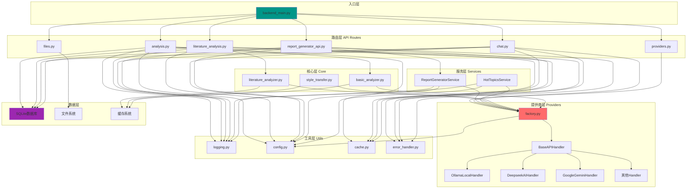

---

## 部署架构

### 开发环境架构

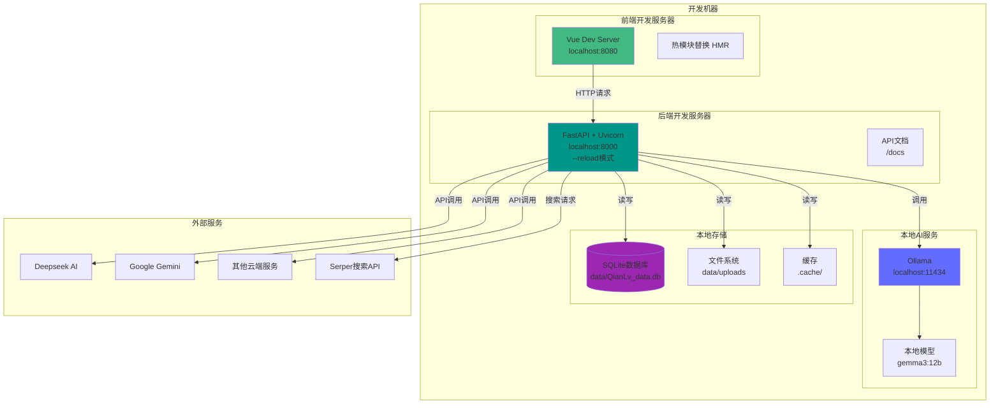

### 生产环境架构

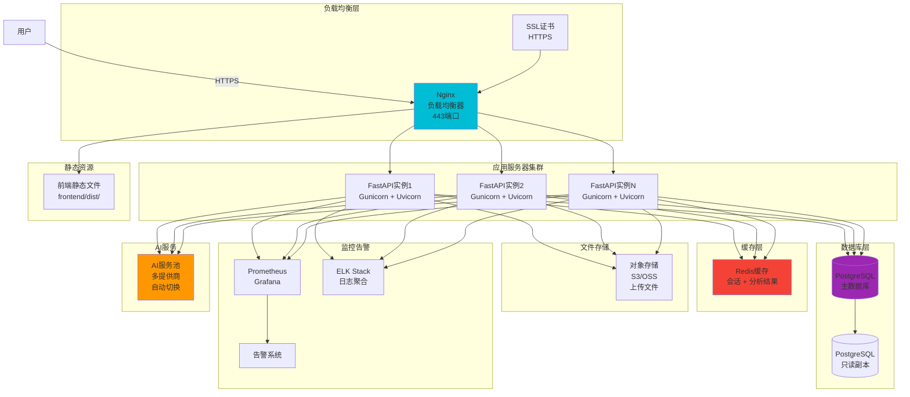

### Docker容器化部署

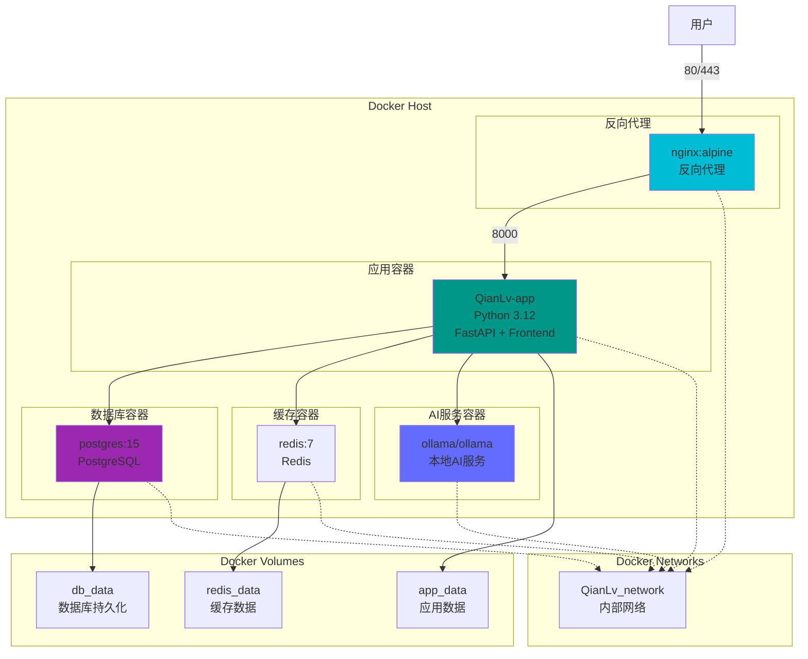

---

## 数据流详解

### 1. 请求-响应数据流

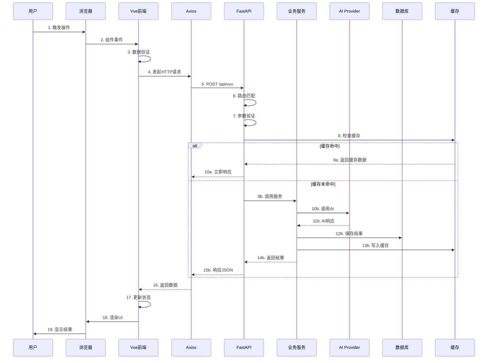

### 2. 流式响应数据流（SSE）

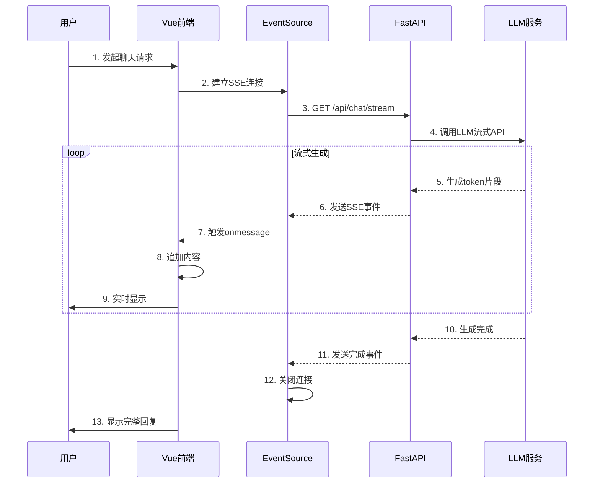

### 3. 配置实时更新数据流

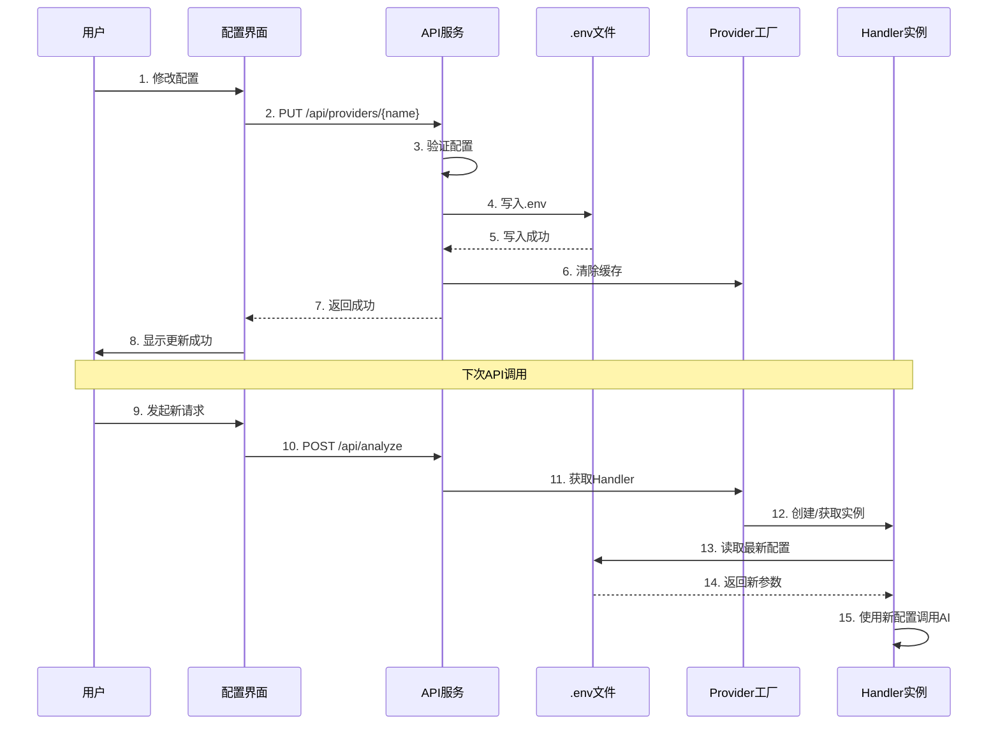

---

## 性能优化架构

### 缓存策略

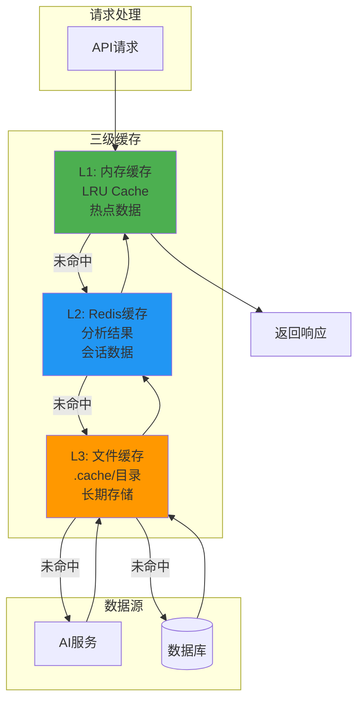

### 异步处理架构

```mermaid
graph TB
    subgraph "同步请求"
        Sync[快速查询<br/>缓存读取<br/>简单分析]
    end
    
    subgraph "异步任务队列"
```
